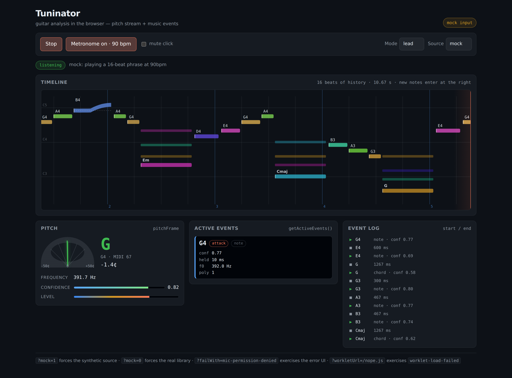

# Tuninator-Example

A Vite browser demo for the [`tuninator`](https://github.com/trellos/Tuninator) guitar-analysis
library: a scrolling note timeline, a 90 bpm metronome, and a live tuner readout driven by the
library's `pitchFrame` and `MusicEvent` streams.



Everything here goes through `tuninator`'s **public API only** — `createTuninator()` plus the types
exported from the package entry point. Nothing reaches into `tuninator/src/**` internals.

---

## Quick start

```bash
npm install
npm run dev          # http://localhost:5173
```

The library is a sibling checkout, declared as `"tuninator": "file:../Tuninator"`, so the layout is:

```
parent/
├── Tuninator/          # the library
└── Tuninator-Example/  # this repo
```

| script | what it does |
| --- | --- |
| `npm run dev` | Vite dev server with HMR, including changes to the library's source |
| `npm run build` | `tsc --noEmit` then `vite build` |
| `npm run typecheck` | typecheck only |
| `npm run preview` | serve the production build |
| `npm run smoke` | headless Chromium smoke test against the mock + saves `screenshot.png` |
| `npm run smoke:live` | the above, plus the real library against a fake audio device |

## URL parameters

| parameter | effect |
| --- | --- |
| *(none)* | **auto** — use the real library, falling back to the mock if it cannot be constructed |
| `?mock=1` | force the synthetic source (no microphone, no permission prompt) |
| `?mock=0` | force the real library |
| `?mode=lead\|chords\|rhythm\|raw` | initial `TuninatorMode` |
| `?workletUrl=/nope.js` | point the library at a missing worklet, to exercise `worklet-load-failed` |
| `?failWith=<TuninatorErrorCode>` | make the mock's `start()` fail with that code, to exercise the error UI |
| `?metronome=1` | start the metronome on load |
| `?autostart=1` | start listening on load |

Source and mode are also switchable from the toolbar at runtime.

---

## The worklet asset

The library needs a `workletUrl` pointing at its built AudioWorklet bundle. This demo passes
`/assets/tuninator-worklet.js`.

**That file is a copy of the library's `dist/tuninator-worklet.js`.** It is not authored here and it
is not committed — `.gitignore` excludes it, and `public/assets/.gitkeep` keeps the directory. The
copy is automatic: `vite.config.ts` installs a small plugin that copies
`../Tuninator/dist/tuninator-worklet.js` into `public/assets/` on every build and dev-server start,
and re-copies it whenever the library is rebuilt while the dev server is running.

So the ordinary workflow is:

```bash
cd ../Tuninator && npm run build   # produces dist/tuninator-worklet.js
cd ../Tuninator-Example && npm run dev
```

If the library has not been built yet, the copy step **warns and continues** rather than failing the
build. The demo still runs against the mock; the live path then reports `worklet-load-failed` in the
UI, which is the correct and legible outcome rather than a crash.

## Building against the library's source

`vite.config.ts` aliases `tuninator` to `../Tuninator/src/index.ts`, and `tsconfig.json` mirrors that
with a `paths` entry.

This exists because the library's `dist/` is produced by a concurrent workstream and may not exist
when you clone. Resolving the package through its `exports` map (`./dist/index.js`) would fail; the
alias keeps the demo building today and gives live reload on library changes.

`src/index.ts` **is** the library's public entry point, so this is not a way around the public API —
it is the public API, in source form. The rule the demo holds itself to is that this alias is the
only path into the library and no import ever deepens into `tuninator/src/**`.

> One consequence worth knowing: `tsconfig.json` deliberately leaves `noUnusedLocals` and
> `noUnusedParameters` off. The `paths` entry puts the library's own source into this TypeScript
> program, and compiler options cannot be applied per file — so those two *style* flags would fail
> this repo's build on unused variables in library code it does not own. Every flag that is on is a
> type-safety flag.

---

## What the demo shows

### Timeline (`src/timeline.ts`)

A canvas, redrawn on `requestAnimationFrame`.

- **Window**: 16 beats of history. At 90 bpm that is `16 × 666.67ms = 10.667s` on screen.
- **Geometry**: `x(t) = width × (1 − (now − t) / windowMs)`. New material enters at the **right**
  edge and the field scrolls **left**.
- **Bar length is event duration.** An event that has not ended yet (`endedAt === null`) is drawn out
  to the right edge and grows as it is held.
- **Beat gridlines come from the metronome's own clock**, so a note played on the click sits on a
  gridline. Bar lines (every 4 beats) are brighter and numbered.
- **Pitch is the vertical axis**, with hue per pitch class and lightness rising with octave; the
  range eases to fit whatever is on screen. Octave guides are labelled `C3`, `C4`, …
- **Bars are labelled** with `label.name`, and **dimmed in proportion to `confidence`** rather than
  hidden.
- **Bends stay one event.** `bend.centsFromStart` is sampled into a short per-event trace and drawn
  as a ribbon curving away from a dashed line at the origin pitch.
- `devicePixelRatio` is honoured, so nothing is blurry on a HiDPI display.

### Metronome (`src/metronome.ts`)

A textbook Web Audio **lookahead scheduler**: a `setInterval` of 25 ms decides *what* to play and
queues clicks ~100 ms ahead with `oscillator.start(audioContext.currentTime + …)`. Precision comes
entirely from those sample-accurate start times. Beat 1 of 4 is accented.

Clicks are never scheduled from `requestAnimationFrame` — rAF follows display refresh, is throttled
in background tabs, and jitters by whole frames, all of which is plainly audible on a click track.
rAF is used only for drawing.

### Panels (`src/ui.ts`)

Start/stop, `state` + `status` + `error`, live frequency and confidence, nearest note with cents and
a needle, the active `MusicEvent` (including chord tones, alternatives and bend excursion), and a
scrolling log of event starts and ends. The mode selector calls `setMode()` and works while
listening, as the API documents.

### Error handling

Every `TuninatorErrorCode` — `mic-unavailable`, `mic-permission-denied`, `audio-context-failed`,
`worklet-unavailable`, `worklet-load-failed`, `unknown` — has a titled, human-readable explanation
in the error banner. Nothing is left to a bare console throw: `start()` rejections, `error` events,
`window.onerror` and unhandled rejections all funnel into the same banner, and anything that is not
already a `TuninatorError` is normalised into one.

Try `?failWith=mic-permission-denied` (mock) or `?workletUrl=/nope.js` (real library).

### Mock source (`src/mock-tuninator.ts`)

A synthetic `Tuninator` that plays a fixed 16-beat phrase at 90 bpm — a lick, a bent B4, and three
chords (Em, Cmaj, G) — emitting the same `pitchFrame` and `musicEvent*` streams as the real library,
including silence frames with `frequencyHz: null` between notes.

It was written so the whole UI could be built and verified before the detector existed, and it stays
useful afterwards as a deterministic UI test harness that needs no microphone, no permission prompt
and no audio hardware. `npm run smoke` drives it.

---

## Notes on the public API

Places where `types.ts` did not quite cover what the demo needed. None were worked around by
reaching into internals; each is handled defensively in the demo instead.

1. **No way to share an `AudioContext`.** `TuninatorOptions` has no `audioContext` field and
   `Tuninator` has no getter for the one it creates. The metronome therefore runs its own context,
   and metronome time cannot be aligned to analysis time through the audio clock.
   `Metronome.useContext()` exists for the day the API allows it.

2. **`PitchFrame.timestamp` has no documented epoch.** It is specified as "monotonic" and comparable
   with `MusicEvent` timestamps, but not as sharing an origin with `performance.now()`. A scrolling
   timeline needs `now` in the same clock, so `src/main.ts` estimates the offset between the two
   clocks (`Timebase`) instead of assuming they match.

3. **`start()`'s rejection type is unspecified.** It is typed `Promise<void>`, so whether it rejects
   with a `TuninatorError`, a `DOMException` from `getUserMedia`, or nothing at all (errors arriving
   only via the `error` event) is not part of the contract. The demo handles all three and normalises
   whatever it gets.

4. **`TuninatorError` is a plain object, not an `Error`.** It has no stack and fails `instanceof`, so
   consumers need a structural type guard to tell it apart from other throwables.

5. **Every field of `EventPitch` is optional except `role` and `confidence`.** A consumer cannot rely
   on getting *any* pitch information from an event, which is a problem for a view that must place a
   note vertically. The timeline tries `midi`, then `frequencyHz`, then parsing `name`, then parsing
   `label.name`, and skips the bar if all four are absent.

6. **The library's default `workletUrl` does not survive bundling.** It resolves
   `new URL("./tuninator-worklet.js", import.meta.url)`, which is correct when consuming the
   unbundled `dist/index.js` but points at a non-existent sibling of the output chunk when the
   library is bundled from source — Vite warns about exactly this at build time. The demo always
   passes an explicit `workletUrl`, so it is unaffected.

7. **No `dispose()`.** `stop()` returns to `idle`, but there is no documented way to release the
   `AudioContext` and microphone permanently, which the source switcher would use.

Minor: there is no exported frequency↔note helper, so the timeline carries its own small copy for
turning an `EventPitch` into a vertical position. `PitchFrame.nearest` covers the tuner readout, so
this only matters for event rendering.
